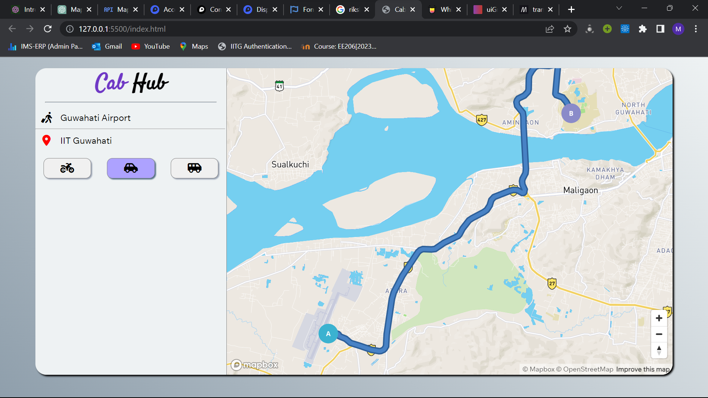
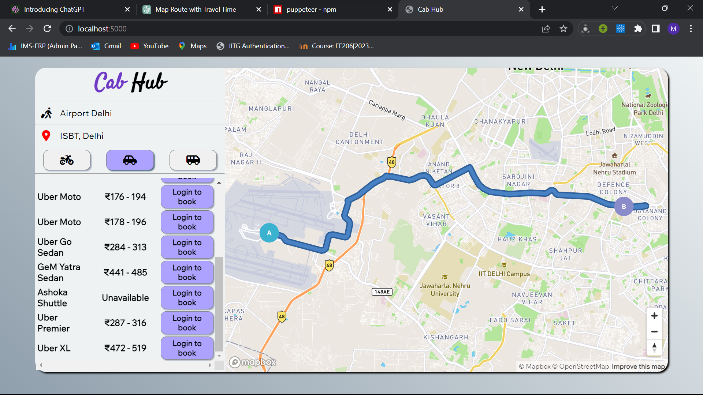
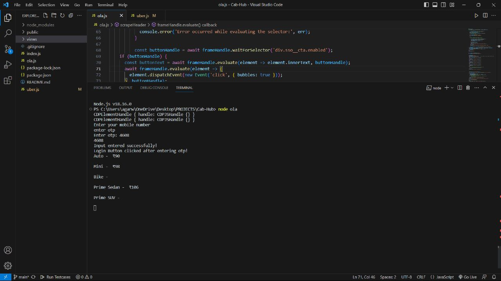

# Cab-Hub

Contents

* [Introduction](#introduction) 
* [Features & Specialities](#key-features--specialities) 
* [Techsacks used, installation, execution](#techstacks) 
* [Snippets of web application](#web-application-snippets) 
* [Contributors](#contributors) 

## Introduction

This is a Node.js based web application for the cab fare estimation. It provides easy route search from one place to another. Additionally, it provides features like direct to redirection to cab booking portal on a single click.

## Key Features & Specialities

* Route search
* Estimated cab fare for an easy and hassle-free ride
* Redirection Link to the respective cab booking portal
* Nearly accurate cab fares scraped from Trust-worthy sites like Uber.
* Easy to use UI

## Techstacks

### Techstacks used
* Node.js
* HTML
* CSS
* Javascript

### Libraries used

* Puppeteer
* Express
* Mapbox API

### Installation

1. Clone the repository `git clone https://github.com/Swapn2003/Cab-Hub`

2. Install all packages and project dependencies `npm install`

3. Run the website on localhost:5000

### Execution

* Start the server `npm start` or `nodemon server.js` 

## Snippets of Web Application

1. Route Search Feature 

 

2. Estimating Uber cab Prices for Desired Ride 

 

3. Estimating Ola cab Prices for desired Ride on Server-side 

 

## Contributors

* [Maharsh Raval](https://github.com/Maharsh04 "Maharsh Raval")
* [Swapn Agarwal](https://github.com/Swapn2003 "Swapn Agarwal")

>Happy Coding !!
